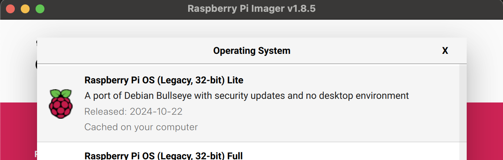
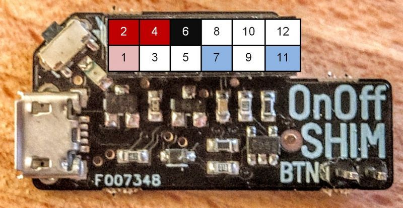
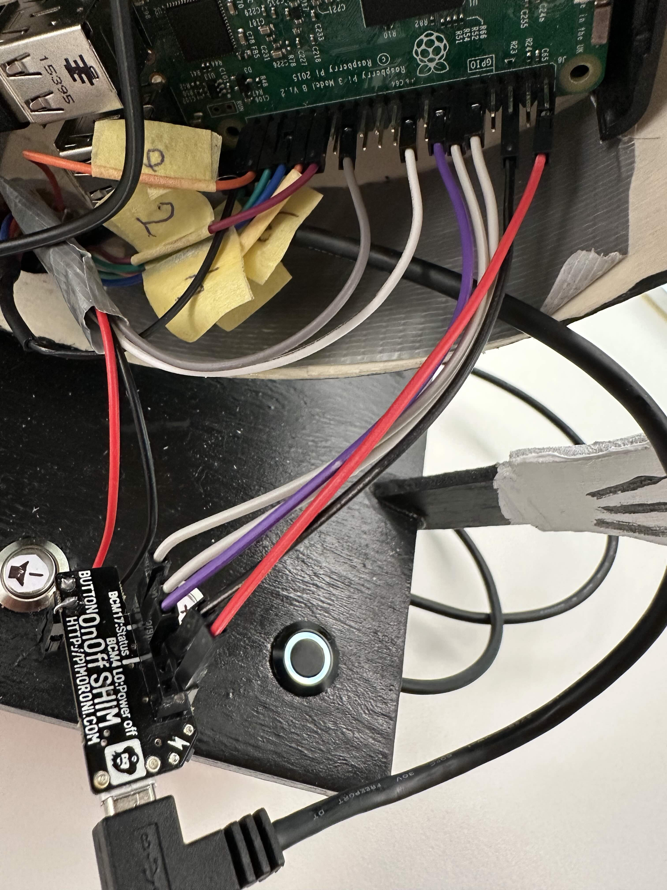

# Phoniebox

This is the [Phoniebox](https://github.com/MiczFlor/RPi-Jukebox-RFID) I created with my kids.


[Watch the video on YouTube](https://www.youtube.com/shorts/znsAAv1EgLk)


<iframe width="560" height="315" src="https://www.youtube.com/shorts/znsAAv1EgLk" 
frameborder="0" allow="accelerometer; autoplay; clipboard-write; encrypted-media; gyroscope; picture-in-picture" allowfullscreen>
</iframe>

## Table of Contents
* [Raspbian Installation](#raspbian-installation)
* [OnOff SHIM Installation](#onoff-shim-installation)
* [Phoniebox Installation](#phoniebox-installation)
* [References](#references)

---

## Raspbian Installation

1. Download and install the Bullseye Lite version of Raspberry Pi OS on an SD card.
   
2. Insert the SD card into your Raspberry Pi and connect it to Ethernet.
3. Install Wi-Fi drivers (not included in the Lite version), configure Wi-Fi settings, and verify the connection. Once confirmed, unplug the Ethernet cable.

   Install Wi-Fi drivers:
   ```bash
   sudo apt install firmware-brcm80211 wpasupplicant wireless-tools
   ```

   Configure Wi-Fi settings:
   ```bash
   sudo nano /etc/wpa_supplicant/wpa_supplicant.conf
   ```

   Example configuration:
   ```bash
   country=CH
   network={
           ssid="SSID"
           psk="Password"
   }
   ```

---

## OnOff SHIM Installation

The Phoniebox is powered by a power bank, so I needed a power on/off button to safely cut power to the Raspberry Pi.

This [blog](https://koboldimkopf.wordpress.com/2020/01/10/tutorial-phoniebox/) recommended the [OnOff SHIM from Pimoroni](https://shop.pimoroni.com/products/onoff-shim), which was perfect for my needs.





### Connecting the GPIO Pins

Connect the OnOff SHIM to the Raspberry Pi GPIO pins as follows:
* **Pin 2** → **Pin 2** on RPi (5V)
* **Pin 6** → **Pin 6** on RPi (Ground)
* **Pin 7** → **Pin 7** on RPi (GPIO4) (default is Pin 7, but I changed it to Pin 13 (GPIO27) and needed to use wires)
* **Pin 9** → **Pin 9** on RPi (Ground)
* **Pin 11** → **Pin 11** on RPi (GPIO17, trigger)


- **Pin 11** triggers the shutdown process.
- Once the shutdown is complete, **Pin 7** (connected to GPIO27 in my case, but usually on GPIO4) is pulled low, cutting power to the Raspberry Pi.

I had an issue with **Pin 7 (GPIO4)**, because on my Raspberry Pi it was always high and there was no way to set it to low. So the low signal was never sent to the OnOff SHIM and the raspberrypi was not powering off after the shutdown. Changing it to **Pin 13 (GPIO27)** allowed me to set the pin to low, notifying the pin 7 on OnOff SHIM to cut power.


To make this change you need to edit the `cleanshutd.conf` file:
```bash
sudo nano /etc/cleanshutd.conf
```

Update the `poweroff_pin` to match GPIO27:
```bash
# Config for cleanshutd
trigger_pin=17
led_pin=17
poweroff_pin=27  # Changed from default (4) to GPIO27
hold_time=1
shutdown_delay=0
polling_rate=1
```




To make it work, you need to use a pin that is alwayy set to HIGH. In my case, apart from the GPIO4, all the pins were set to low in the start-up. So I needed to force the GPIO27 to HIGH on start-up. 

### Configuring the GPIO27 to pull up (HIGH) on startup

There are 2 ways to to force the pull-up configuration.


#### 1. Add instruction to /boot/config.txt

Adding the following to `/boot/config.txt`:
   ```bash
   gpio=27=ip,pu
   ```
This unfortunately did not work for me

#### 2. Creating a Service for GPIO27 Pull-Up

1. Create a new script to force the pull-up on GPIO27:

Open a terminal and create a script to apply the pull-up:

```bash
sudo nano /usr/local/bin/force_gpio27_pullup.sh
```
Add the following content:

```
#!/bin/bash
raspi-gpio set 27 ip pu
```
Save and exit (press CTRL + X, then Y to confirm).

2. Make the script executable:

```bash
sudo chmod +x /usr/local/bin/force_gpio27_pullup.sh
```

3. Create a systemd service to run the script after boot:

Create the service:

```bash
sudo nano /etc/systemd/system/force-gpio27.service
```

Add the following content:
```bash
[Unit]
Description=Force GPIO27 pull-up
After=multi-user.target

[Service]
Type=oneshot
ExecStart=/usr/local/bin/force_gpio27_pullup.sh
RemainAfterExit=yes

[Install]
WantedBy=multi-user.target
```
Save and exit (press CTRL + X, then Y to confirm).

4. Enable the service:
```bash
sudo systemctl enable force-gpio27.service
```

5. Reboot the RPi
```bash
sudo reboot
```

6. Check GPIO27 again:
```bash
raspi-gpio get 27
```

It should now show:

```bash
GPIO 27: level=1 fsel=0 func=INPUT
```

---

## Phoniebox Installation

To install phoniebox software, you can simply use the one line install command you can find in the main [documentation](https://github.com/MiczFlor/RPi-Jukebox-RFID/wiki/INSTALL#one-line-install-command).
```bash
cd; rm install-jukebox.sh; wget https://raw.githubusercontent.com/MiczFlor/RPi-Jukebox-RFID/master/scripts/installscripts/install-jukebox.sh; chmod +x install-jukebox.sh; ./install-jukebox.sh
```

It asks some questions and takes approximately 15minutes to install. 


### GPIO configuration

Below is my configuration for the GPIO buttons, which can be found in the file: `~/RPi-Jukebox-RFID/settings/gpio_settings.ini`. Note that the [documentation](https://github.com/MiczFlor/RPi-Jukebox-RFID/blob/develop/components/gpio_control/README.md) contains examples with much more advance settings, but for my case those simple buttons were enough.
After making changes, remember to restart the service using the command: `sudo systemctl restart phoniebox-gpio-control`

```
[DEFAULT]
enabled: True
antibouncehack: False

[Random]
enabled: True
Type: Button
Pin: 21
functionCall: functionCallPlayerRandomFolder

[Prev]
enabled: True
Type: Button
Pin: 5
functionCall: functionCallPlayerPrev

[Pause]
enabled: True
Type: Button
Pin: 6
functionCall: functionCallPlayerPause

[Next]
enabled: True
Type: Button
Pin: 13
functionCall: functionCallPlayerNext

[DOWN]
enabled: True
Type: Button
Pin: 19
functionCall: functionCallVolD

[UP]
enabled: True
Type: Button
Pin: 26
functionCall: functionCallVolU
```

---

## References

Special thanks to the original [Phoniebox](https://github.com/MiczFlor/RPi-Jukebox-RFID/) project and all the tutorials, I could find online that helped me setup my OnOff shim:
* [Kobold im Kopf Tutorial](https://koboldimkopf.wordpress.com/2020/01/10/tutorial-phoniebox/)
* [SplittScheid Tutorial](https://splittscheid.de/phoniebox-bauanleitung-toniebox-alternative/)
* [YouTube Tutorial](https://www.youtube.com/watch?v=9S8yvfvFSNg)


